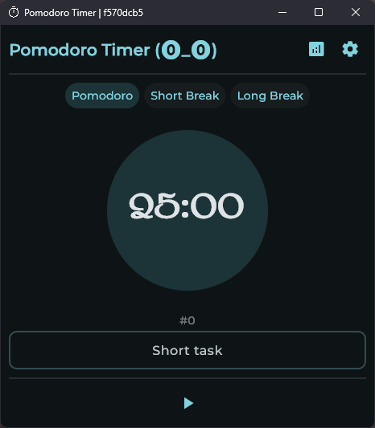
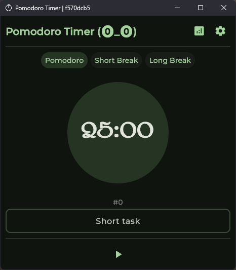

# Miniature Waffle (Pomodoro Timer)

A simple, customizable Pomodoro Timer built with **Flet**.  
Track your work/rest sessions, view statistics, and tailor the timer to your needs.

## Screenshots

<div align="center">
  
  
  
</div>

## Features

- Session tracking and data persistence  
- Customizable durations for work, short break, and long break  
- Theme customization (colors via hex values supported)  
- Sound / audio feedback (if needed)  
- History / statistics of completed pomodoros  

## Installation

### Using Poetry

1. Clone the repository:  
   ```bash
   git clone https://your-repo-url.git
   cd your-repo-directory
   ```

2. Create and activate a virtual environment with Poetry:

   ```bash
   poetry install
   poetry shell
   ```

3. Run the app:

   ```bash
   poetry run python main.py
   ```

### Using pip and venv

1. Create a virtual environment
   Linux
   ```bash
   python3 -m venv venv
   source venv/bin/activate
   ```
   Windows
   ```powershell
   python -m venv .venv
   .venv\Scripts\activate
   ```
2. Install dependencies:
   ```bash
   pip install "flet>=0.28.3,<0.29.0"  
   pip install "flet-audio>=0.1.0,<0.2.0"
   ```
3. Run the app:
   ```bash
   python main.py
   ```

## Packaging into an executable (.exe)

You can bundle the app into a Windows executable

**Using `flet build`**
Flet provides a built-in command to build desktop executables without relying on PyInstaller

```bash
flet build windows `
  --product "product" `
  --description "description" `
  --module-name main.py `
  --output dist
```

## Theme / Colors

You can configure the app theme using Flet color names or **hex values**.
Example color names

```
yellow200  
pink
```

You can also use hexadecimal color codes, for example: `#FFEB3B`, `#E91E63`, etc.
